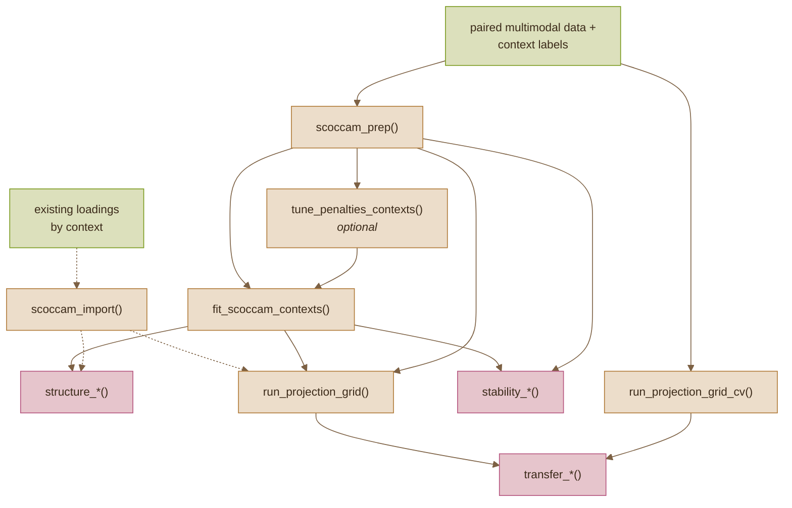

# scOCCAM

`scOCCAM` 
(sparse **s**ingle-**c**ell) **O**mics **C**ross-**C**ontext **A**greement **M**aps

do 'omic correlations in one cell type extend to others?

**what?** `scOCCAM` is an R package that helps visualize and quantify the specificity of 'omic' links across contexts (across cell types, batches, treatment groups, etc), with special emphasis on sparse multiomic correlation patterns. 

**why?**
* there are established methods to interrogate multi-'omic relationships, including the construction of sparse networks (with sparsity arguably more interpretable).
* however, i've found their adaptation to the single-cell setting incomplete: namely, assessing cell-type specificity is a fundamental task with single-cell data.
* but how can we assess whether multiomic relationships are context-shared or -specific?

## example gallery

example visualizations from `scOCCAM`'s application on the "bmcite" bone-marrow CITE-seq dataset (500 RNA genes, 25 antibody-derived tags or ADT) across five cell types x two batches (ten contexts). The resulting cross-context sCCA networks suggest RNA-ADT correlations reproduce across batches (i.e., limited technical effect) but not across cell types (true between type biological effect).

![example scOCCAM visualizations. (a) loadings by factor. (b) MDS plot based on Jaccard distance and (c) heatmap of Jaccard distances by top loading features of ADT [left] and gene features [right] suggests replicate batches overlap, cell types do not. (d) multi-modal ADT-RNA correlation edges, with nodes positioned by gene-gene expression.](man/figures/gallery-readme.png)

# pipeline

* `scOCCAM` includes wrappers to apply Sparse Canonical Correlation Analysis (`PMA`) from raw data to multiomic network as the frontline method. Sparse PCA, DIABLO (`mixOmics`), and custom networks (i.e., pre-tabulated single- or multiomic node-edge data) are also supported.
* the multiomic association is fit per cell-type, or other context of interest (e.g., batch, treatment, or case-control).
* we then assess whether the resulting fit on Context A is common to other contexts B, C, D, ..., with a focus on exploratory visualization rather than statistical inference.

## quick start

install R package via this repo
~~~r
# install.packages("remotes")
remotes::install_github("chooliu/scOCCAM")

# optional depndencies
install.packages(c("ggplot2", "ggrepel"))  # plots
install.packages("PMA")                    # sCCA
BiocManager::install("mixOmics")           # sPLS, DIABLO
~~~
example seurat --> sCCA example on "bmcite" dataset
~~~r
# libraries
library(scOCCAM)
library(Seurat)

# load data
bm  <- SeuratData::LoadData("bmcite") 
hvg <- head(VariableFeatures(bm), 500L)

blocks <- read_seurat_v5_blocks(
  bm,
  x_assay = "ADT", x_layer = "scale.data",
  y_assay = "RNA", y_layer = "scale.data",
  y_features = hvg
)

# structure into scoccam expect format
ctx  <-
	paste(blocks$obs$celltype.l1,
	blocks$obs$donor, sep = " | ")
prep <- scoccam_prep(
  blocks$X, blocks$Y,
  context = ctx)

# tune models
cb <- context_blocks(prep)
pen <- tune_penalties_contexts(
  cb$X, cb$Y,
  penalty_grid = list(penalty_x = seq(0.1, 0.8, 0.1),
                      penalty_y = seq(0.1, 0.8, 0.1)),
  n_perm = 25L, n_cores = 4L, seed = 1234)

# fit one model per context
fits <- fit_scoccam_contexts(
	cb, K = 5L, method = "scca",
	penalties = pen, seed = 1234)
~~~

following the multiomic fit via sCCA (alt: sPLS and DIABLO are also bundled), diagnostics and visualizations then fall into three main categories: assessing the within-context **structure**, the **stability** of a fit, and the between-context **transferability**. a minimal example of each follows.
~~~r
# structure
# shared network layout and node positions
# context-specific Pearson edges
structure_scaffold(
  fits, prep,
  x_label = "ADT", y_label = "RNA",
  ncol = 5L, plot = TRUE)

# stability
# resampled refits against the observed fit
cb <- context_blocks(prep)
focus <- names(fits)[1L]
stab <- scoccam_stability(
  fits[[focus]], cb$X[[focus]], cb$Y[[focus]],
  resample = "bootstrap", B = 30L, seed = 1234)
stability_plot(stab, type = "correlation")

# transferability
# top-loading supports from separate context fits
transfer_jaccard(fits, side = "v", K_top = 25L)
~~~

see the [user guide](docs/user-guide.md) and [visualization gallery](docs/viz-gallery.md) (applied to real and synthetic ground truth datasets) for details on: alternative input data formats, preprocessing options, and methods + visualizations used to quantify cross-context agreement.

## related work

inspirations include the following packages that i've primarily seen used in bulk studies: [smCCNet](https://pmc.ncbi.nlm.nih.gov/articles/PMC10690212/)  (from my former research group; inspired cross-validation based approaches), [PMA](https://cran.r-project.org/web/packages/PMA/index.html), and [mixOmics](https://academic.oup.com/bioinformatics/article/35/17/3055/5292387) 

there are many other useful multiomic single-cell methods of note, although they do not intrinsically examine between-context agreement, instead focusing on objectives like:
* clustering and cell type identification: see [Liu, et al. 2025](https://www.nature.com/articles/s41592-025-02856-3) benchmarks and [Baião, et al. 2025](https://academic.oup.com/bib/article/26/4/bbaf355/8220754) review
* enhancer-regulatory detection, particularly tailored for RNA-ATAC data (e.g.,[SCENIC+](https://www.nature.com/articles/s41592-023-01938-4))
* decomposition into latent factors (e.g., [MOFA+](https://pmc.ncbi.nlm.nih.gov/articles/PMC7212577/)) 

## to-do

**under development:** the package is currently tailored for two modalities collected in paired data from the same samples; currently extending to arbitrary modality count, other common factor structures.

**citation:** if you find `scOCCAM` useful, please cite (pre-print tbd)
